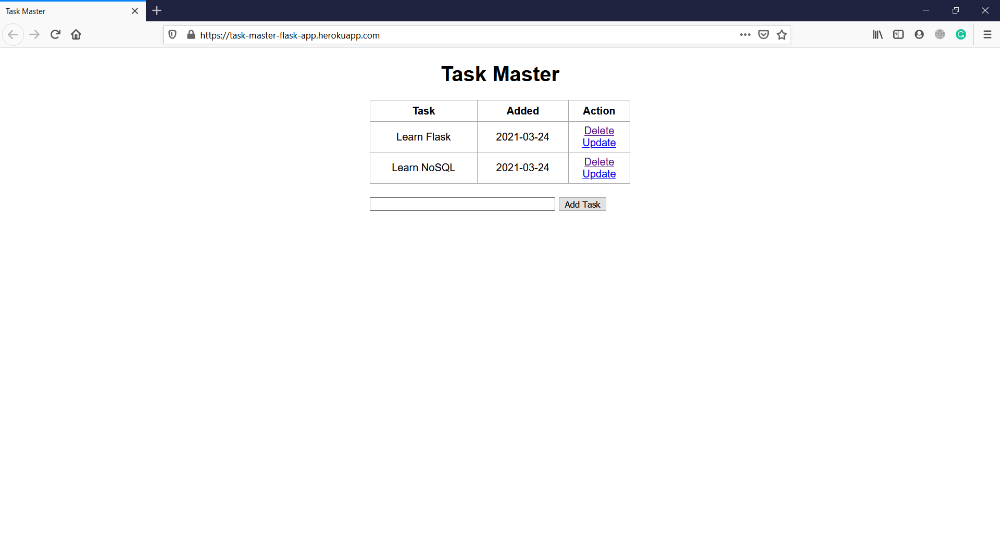

# TaskMaster

A simple TODO list making app.

<p align="center">
  
</p>

### Built With

* [Flask](https://flask.palletsprojects.com/en/1.1.x/) - The python web framework used

### How To Run
1. Install `virtualenv`:
```
$ pip install virtualenv
```

2. Open a terminal in the project root directory and run:
```
$ virtualenv env
```

3. Then run the command:
```
$ .\env\Scripts\activate
```

4. Then install the dependencies:
```
$ (env) pip install -r requirements.txt
```

5. Finally start the web server:
```
$ (env) python app.py
```

This server will start on port 5000 by default. You can change this in `app.py` by changing the following line to this:

```python
if __name__ == "__main__":
    app.run(debug=True, port=<desired port>)
```